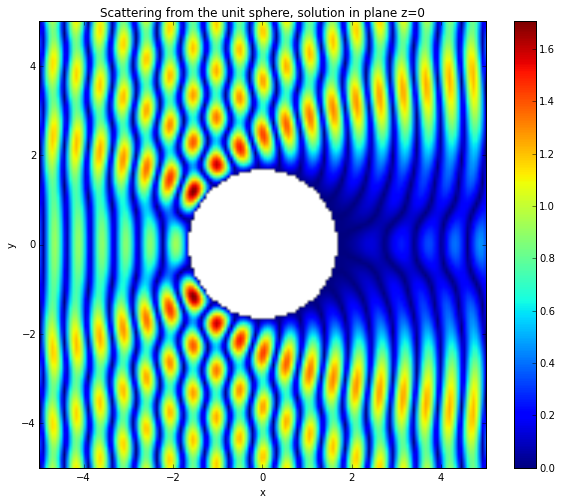

Scattering from a sphere using a combined direct formulation
============================================================

Background
~~~~~~~~~~

In this tutorial we will solve the problem of scattering from the unit
sphere :math:`\Omega` using a combined integral formulation and an
incident wave:

.. math::

   u^{\text{inc}}(\mathbf x) = e^{i k x},

where :math:`\mathbf x = (x, y, z)^t`.

The PDE is given by the Helmholtz equation:

.. math::

   \Delta u + k^2 u = 0, \quad \text{ in } \mathbb{R}^3 \backslash \Omega,

where :math:`u=u_s+u_{inc}` is the total acoustic field and
:math:`u_{s}` satisfies the Sommerfeld radiation condition

.. math::

   \frac{\partial u_s}{\partial r}-iku_s=o(r^{-1})

for :math:`r:=\frac{\mathbf x}{|x|}\rightarrow\infty`.

From Green's representation formula one can derive that

.. math::

   u(\mathbf x) = u_{inc}-\int_{\Gamma}g(\mathbf x,\mathbf y)u_n(\mathbf y)ds(y).

Here, :math:`g(\mathbf x, \mathbf y)` is the acoustic Green's function
given as

.. math::

   g(\mathbf x, \mathbf y):=\frac{e^{i k \|\mathbf{x}-\mathbf{y}\|}}{4 \pi \|\mathbf{x}-\mathbf{y}\|}.

The direct combined integral equation to solve this problem is given by

The problem has therefore been reduced to computing the normal
derivative :math:`u_n` on the boundary :math:`\Gamma`. This is achieved
through the following boundary integral equation formulation.

.. math::

   (I + D_k' - i \eta S_k) u_n = 2 \frac{\partial u^{\text{inc}}}{\partial \nu}(x) - 2 i \eta u^{\text{inc}}(x), \quad x \in \Gamma.

where :math:`I,D_k'` and :math:`S_k` are respectively the identity
operator, the adjoint double layer boundary operator and the single
layer boundary operator. More details of the derivation of this
formulation and its properties can be found in the article
`*Numerical-asymptotic boundary integral methods in high frequency
acoustic
scattering* <http://journals.cambridge.org/action/displayAbstract?fromPage=online&aid=8539370&fileId=S0962492912000037>`__
by S. N. Chandler-Wilde, I. G. Graham, S. Langdon and E. A. Spence.

Implementation
~~~~~~~~~~~~~~

We define the wavenumber

.. code:: python

    k = 10.
The rhs of the combined formulation is defined as follows.

.. code:: python

    import numpy as np
    def dirichlet_data(x,n,domain_index,result):
        result[0] = 2j * k * np.exp(1j * k * x[0]) * (n[0]-1) 
The following command loads the mesh.

.. code:: python

    from bempp.file_interfaces import gmsh
    grid = gmsh.GmshInterface("../../meshes/sphere-h-0.1.msh").grid
In order to check how many elements the mesh has we can use the
following command

.. code:: python

    print("The grid has {0} elements".format(grid.leaf_view.entity_count(0)))

.. parsed-literal::

    The grid has 2570 elements

As basis functions we use piecewise constant functions over the elements
of the mesh. The corresponding space is initialized as follows.

.. code:: python

    from bempp import function_space
    piecewise_const_space = function_space(grid,"DP",0)
We now initialize the boundary operators. A boundary operator always
takes at least three space arguments: a domain space, a range space and
the test space (dual to the range). In this example we only work on the
space :math:`L^2(\Gamma)` and we can choose all spaces to be identical.

.. code:: python

    from bempp.operators.boundary import helmholtz as boundary_helmholtz
    from bempp.operators.boundary import sparse
    
    id = sparse.identity(piecewise_const_space, piecewise_const_space, piecewise_const_space)
    adlp = boundary_helmholtz.adjoint_double_layer(piecewise_const_space, piecewise_const_space, piecewise_const_space,k)
    slp = boundary_helmholtz.single_layer(piecewise_const_space, piecewise_const_space, piecewise_const_space,k)
Standard arithmetic operators can be used to create linear combinations
of boundary operators.

.. code:: python

    lhs = id + 2* adlp - 2j * k * slp
Use the dirichlet\_data() Python function defined earlier to initialize
the grid function that represents the right-hand side. If we specify a
GridFunction using a Python function as input we will need to declare
not only a function space, but also its dual in order to compute the
projection of the python function onto the space.

.. code:: python

    from bempp import GridFunction
    dirichlet_fun = GridFunction(piecewise_const_space, dual_space=piecewise_const_space, fun=dirichlet_data,complex_data=True)
    rhs = dirichlet_fun
In the above command the parameter ``complex_data=True`` is necessary
since the C++ kernel of BEM++ needs to know whether the Python functions
returns real data or complex data.

We can now use Gmres to solve the problem.

.. code:: python

    from bempp.linalg.iterative_solvers import gmres
    neumann_fun,info = gmres(lhs,rhs,tol=1E-5)
Gmres returns a grid function neumann\_fun and an integer info. When
everything works fine info is equal to 0.

At this stage, we have the surface solution of the integral equation.
Now we will evaluate the solution in the domain of interest. We define
the evaluation points as follows.

.. code:: python

    Nx=150
    Ny=150
    xmin,xmax,ymin,ymax=[-3,3,-3,3]
    plot_grid = np.mgrid[xmin:xmax:Nx*1j,ymin:ymax:Ny*1j]
    points = np.vstack((plot_grid[0].ravel(),plot_grid[1].ravel(),np.zeros(plot_grid[0].size)))
    u_evaluated=np.zeros(points.shape[1],dtype=np.complex128)
    u_evaluated[:] = np.nan
Then we create a single layer potential operator and use it to evaluate
the solution at the evaluation points.

.. code:: python

    x,y,z=points
    idx=np.sqrt(x**2+y**2)>1.0
The variable idx allows to compute only points located outside the unit
circle of the plane. We use a single layer potential operator to
evaluate the solution at the observation points.

.. code:: python

    from bempp.operators.potential import helmholtz as helmholtz_potential
    slp_pot=helmholtz_potential.single_layer(piecewise_const_space,points[:,idx],k)
    u_evaluated[idx] =np.real(np.exp(1j *k * points[0,idx]) - slp_pot.evaluate(neumann_fun))
We can now plot the solution.

.. code:: python

    u_evaluated=u_evaluated.reshape((Nx,Ny))
    
    %matplotlib inline 
    # Plot the image
    from matplotlib import pyplot as plt
    fig=plt.figure(  figsize =(10, 8))
    plt.imshow(np.abs(u_evaluated.T),extent=[-5,5,-5,5])
    plt.xlabel('x')
    plt.ylabel('y')
    plt.colorbar()
    plt.title("Scattering from the unit sphere, solution in plane z=0")

.. parsed-literal::

    <matplotlib.text.Text at 0x10fc4dc50>

