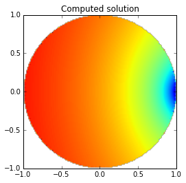

Solving a Laplace problem with Dirichlet boundary conditions
============================================================

Background
~~~~~~~~~~

In this tutorial we will solve a simple Laplace problem inside the unit
sphere :math:`\Omega` with Dirichlet boundary conditions. The PDE is
given by

.. math::

   \Delta u = 0

in :math:`\Omega` with boundary conditions

.. math::

   u = g

on the boundary :math:`\Gamma` of :math:`\Omega`. The boundary data is a
source :math:`\hat{u}` located at the point :math:`(.9,0,0)`.

.. math::

   \hat{u}(\mathbf x)=\log(\sqrt{(x-.9)^2+y^2+z^2}).

For this example we will use an direct integral equation of the first
kind. Let

.. math::

   g(\mathbf x,\mathbf y) = \frac{1}{4\pi |\mathbf x-\mathbf y|}

the Green's function in three dimensions with
:math:`|\mathbf x|^2=x^2+y^2+z^2`. Then from Green's representation
theorem it follows that every function :math:`u` harmonic in
:math:`\Omega` satisfies

.. math::

   u(\mathbf x) = \int_{\Gamma} g(\mathbf x,\mathbf y)\frac{\partial u(\mathbf y)}{\partial n(\mathbf{y})}ds(\mathbf y)-\int_{\Gamma}\frac{\partial g(\mathbf x,\mathbf y)}{\partial n(\mathbf{y})}u(\mathbf y)ds(\mathbf y),~\mathbf x\in\Omega.

Taking the limit :math:`\mathbf x\rightarrow \Gamma` we obtain the
boundary integral equation

.. math::

   \left[V\frac{\partial u}{\partial n}\right](\mathbf x)=\frac12 u(\mathbf x)+\left[Ku\right](\mathbf x),~\mathbf x\in\Gamma.

Here, :math:`V` and :math:`K` are the single and double-layer potential
boundary operators defined by

.. math::

   \begin{align}
   \left[V\phi\right](\mathbf x)&=\int_{\Gamma}g(\mathbf x,\mathbf y)\phi(\mathbf y)ds(y)\\
   \left[K\phi\right](\mathbf x)&=\int_{\Gamma}\frac{\partial g(\mathbf x,\mathbf y)}{\partial n(\mathbf{y})}\phi(\mathbf y)ds(\mathbf y)
   \end{align}

for :math:`x\in\Gamma`.

Implementation
~~~~~~~~~~~~~~

In the following we demonstrate how to solve this problem with BEM++. We
first define the known Dirichlet boundary data. In this example we will
use a Python function for it. Other ways are possible (such as a vector
of coefficients at the nodes of a mesh).

.. code:: python

    import numpy as np
    def dirichlet_data(x,n,domain_index,result):
        result[0] = np.log(((x[0]-.9)**2+x[1]**2+x[2]**2)**(0.5))
A valid Python function to define a BEM++ GridFunction takes the inputs
``x``,\ ``n``,\ ``domain_index`` and ``result``. ``x`` is a three
dimensional coordinate vector. ``n`` is the normal direction. The
``domain_index`` allows to identify different parts of a physical mesh
in order to specify different functions on different subdomains.
``result`` is a Numpy array that will store the result of the function
call. For scalar problems it just has one component ``result[0]``.

We now define a mesh or grid in BEM++ notation. Normally one reads a
grid from a file. BEM++ supports import and export to Gmsh with other
data formats to follow soon. However, for this problem we do not need a
complicated mesh but will rather use the built-in function
``grid_from_sphere`` that defines a simple spherical grid.

.. code:: python

    from bempp import grid_from_sphere
    from bempp.file_interfaces import gmsh
    grid = gmsh.GmshInterface("../../meshes/sphere-h-0.1.msh").grid
In order to check how many elements the mesh has we can use the
following command

.. code:: python

    print(grid.leaf_view.entity_count(0))

.. parsed-literal::

    2570

BEM++ uses `Dune-Grid <http://dune-project.org>`__ for its Grid
management and the principle layout of a Dune grid is accessible from
Python via the BEM++ library.

We now define the spaces. For this example we will use two spaces, the
space of continuous, piecewise linear functions and the space of
piecewise constant functions. The space of piecewise constant functions
has the right smoothness the unknown Neumann data. We will use
continuous, piecewise linear functions to represent the known Dirichlet
data.

.. code:: python

    from bempp import function_space
    piecewise_const_space = function_space(grid,"DP",0) # A disccontinuous polynomial ("DP") space of order 0
    piecewise_lin_space = function_space(grid,"P",1)    # A continuous piecewise polynomial ("P") space of order 1
We can now define the operators. We need the identity operator, and the
single-layer, respectively double-layer, boundary operator. The general
calling convention for an operator is

::

    op = factory_function(domain_space,range_space,dual_to_range_space,...)

Typically, for a Galerkin discretisation only the domain space and the
dual space (or test space) are needed. BEM++ also requires a notion of
the range of the operator. This makes it possible to define operator
algebras in BEM++ that can be used almost as if the operators are
continuous objects.

.. code:: python

    from bempp.operators.boundary import sparse
    from bempp.operators.boundary import laplace as boundary_laplace
    id = sparse.identity(piecewise_lin_space, piecewise_lin_space, piecewise_const_space)
    dlp = boundary_laplace.double_layer(piecewise_lin_space, piecewise_lin_space, piecewise_const_space)
    slp = boundary_laplace.single_layer(piecewise_const_space, piecewise_lin_space, piecewise_const_space)
We now define the GridFunction object on the sphere grid that represents
the Dirichlet data. If we specify a GridFunction using a Python function
as input we will need to declare not only a function space, but also its
dual in order to compute the projection of the python function onto the
space.

.. code:: python

    from bempp import GridFunction
    dirichlet_fun = GridFunction(piecewise_lin_space, dual_space=piecewise_const_space, fun=dirichlet_data)
The below code will assemble the identity and double-layer boundary
operator and evaluate the right-hand side of the boundary integral
equation. This is an exact analogue of the underlying mathematical
formulation. Depending on the grid size this command can take a bit
since here the actual operators are assembled. The left-hand side only
consists of the single-layer potential operator in this example. This is
here not yet assembled as it is not yet needed. In BEM++ operators are
only assembled once they are needed.

.. code:: python

    rhs = (.5*id+dlp)*dirichlet_fun
    lhs = slp
We can force the assembly of the ``lhs`` operator also using the
command. But this is optional and would otherwise be done at the
beginning of the iterative solver loop.

.. code:: python

    lhs.weak_form()

.. parsed-literal::

    <2570x2570 DenseDiscreteBoundaryOperator with dtype=float64>

The following code solves the boundary integral equation iteratively
using Conjugate Gradients. BEM++ offers a CG and GMRES algorithm.
Internally these are just simple interfaces to the corresponding SciPy
functions with the difference that the BEM++ variants accept BEM++
operators and GridFunctions as objects instead of just operators and
vectors.

.. code:: python

    from bempp.linalg.iterative_solvers import cg
    neumann_fun,info = cg(slp,rhs,tol=1E-3)
We could have used directly the corresponding SciPy solver using the
commands

::

        from scipy.sparse.linalg import cg
        sol,info = cg(slp.weak_form(),rhs.projections,tol=1E-3)
        neumann_fun = GridFunction(piecewise_const_space,coefficients=sol)
        

We now want to provide a simple plot of the solution in the (x,y) plane
for z=0. First we need to define points at which to plot the solution.

.. code:: python

    n_grid_points = 150
    plot_grid = np.mgrid[-1:1:n_grid_points*1j,-1:1:n_grid_points*1j]
    points = np.vstack((plot_grid[0].ravel(),plot_grid[1].ravel(),np.zeros(plot_grid[0].size)))
The variable ``points`` now contains in its columns the coordinates of
the evaluation points. We can now use Green's representation theorem to
evaluate the solution on these points. Note in particular the last line
of the following code. It is a direct implementation of Green's
representation theorem.

.. code:: python

    from bempp.operators.potential import laplace as potential_laplace
    slp_pot = potential_laplace.single_layer(piecewise_const_space,points)
    dlp_pot = potential_laplace.double_layer(piecewise_lin_space,points)
    u_evaluated = slp_pot*neumann_fun-dlp_pot*dirichlet_fun
We now want to create a nice plot from the computed data. We only plot a
slice through :math:`z=0`. For a full three dimensional visualization
BEM++ allows to export data to Gmsh and VTK.

.. code:: python

    # The next command ensures that plots are shown within the IPython notebook
    %matplotlib inline
    
    # Filter out solution values that are associated with points outside the unit circle.
    u_evaluated = u_evaluated.reshape((n_grid_points,n_grid_points))
    radius = np.sqrt(plot_grid[0]**2+plot_grid[1]**2)
    u_evaluated[radius>1] = np.nan
    
    # Plot the image
    import matplotlib
    matplotlib.rcParams['figure.figsize'] = (5.0, 4.0) # Adjust the figure size in IPython
    
    from matplotlib import pyplot as plt
    
    plt.imshow(u_evaluated.T,extent=(-1,1,-1,1),origin='lower')
    plt.title('Computed solution')

.. parsed-literal::

    <matplotlib.text.Text at 0x1104733d0>

