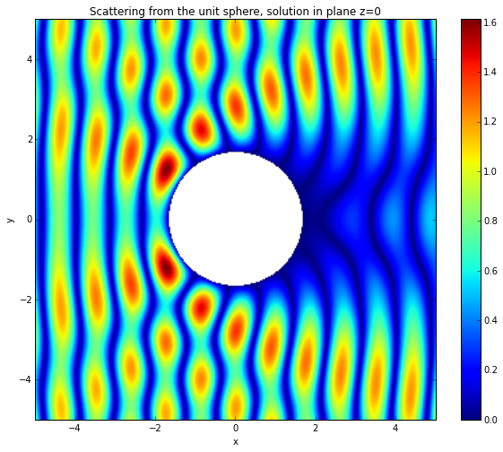

Scattering from a sphere using a combined direct formulation
============================================================

Background
~~~~~~~~~~

In this tutorial we will solve a problem of scattering from the unit
sphere :math:`\Omega` using a combined integral formulation and an
incident wave:

.. math::

   u^{\text{inc}}(x) = e^{i k x_0},

where :math:`x = (x_0, x_1, x_2)^t`.

The PDE is given by the Helmholtz equation:

.. math::

   \Delta u + k^2 u = 0, \quad \text{ in } \mathbb{R}^3 \backslash \Omega,

with boundary conditions :math:`u = - u^{\text{inc}}` on the boundary
:math:`\Gamma` of :math:`\Omega`.

The Direct combined integral equation is

.. math::

   (I + D_k' - i \eta S_k) \frac{\partial u}{\partial \nu}(x) = f(x), \quad x \in \Gamma,

where :math:`I,D_k'` and :math:`S_k` are respectively the identity
operator, the adjoint double layer boundary operator and the single
layer boundary operator.

The right-hand side for this direct integral formulation is

.. math::

   f(x)  = 2 \frac{\partial u^{\text{inc}}}{\partial \nu}(x) - 2 i \eta u^{\text{inc}}(x), \quad x \in \Gamma.

The adjoint double layer and single layer boundary operators are defined
as follows:

.. math::

   \left[ D'_k \right]\phi(x) = 2 \int_{\Gamma} \frac{\partial g}{\partial \nu(x)}(x,y) \phi(y) ds(y), \quad x \in \Gamma,

and

.. math::

   \left[ S_k \right]\phi(x) = 2 \int_{\Gamma} g(x,y) \phi(y) ds(y), \quad x \in \Gamma,

with the Green kernel

.. math::

   g(x,y) = \frac{e^{i k \|x-y\|}}{4 \pi \|x-y\|}.

More details about this direct combined formulation can be found in

:math:`\textit{Condition number estimates for combined potential integral operators in acoustics and their boundary element discretisation}`,Betcke,
T. and al., 2011.

http://arxiv.org/pdf/1007.3074.pdf

:math:`\mbox{}`

Implementation
~~~~~~~~~~~~~~

We define the wavenumber

.. code:: python

    k = 6.
The rhs of combined formulation is defined

.. code:: python

    import numpy as np
    def dirichlet_data(x,n,domain_index,result):
        result[0] = 2j * k * np.exp(1j * k * x[0]) * (n[0]-1) 
A mesh of the unit sphere is created

.. code:: python

    from bempp import grid_from_sphere
    grid = grid_from_sphere(4)
but it is also possible to import a msh file:

                from bempp.file_interfaces import gmsh

grid=gmsh.GmshInterface(file_name="msh_file.msh").grid
                
where msh\_file.msh is a gmsh file containing a surface mesh.

In order to check how many elements the mesh has we can use the
following command

.. code:: python

    print("The grid has {0} elements".format(grid.leaf_view.entity_count(0)))

.. parsed-literal::

    The grid has 512 elements

Create a space of piecewise constant basis function over the grid

.. code:: python

    from bempp import function_space
    
    piecewise_const_space = function_space(grid,"DP",0)
We now initialize the boundary operators. A boundary operator always
takes at least three space arguments: a domain space, a range space and
the test space (dual to the range). Here we just use L^2 projections.
Hence, all spaces are identical.

.. code:: python

    from bempp.operators.boundary import helmholtz as boundary_helmholtz
    from bempp.operators.boundary import sparse
    
    id = sparse.identity(piecewise_const_space, piecewise_const_space, piecewise_const_space)
    adlp = boundary_helmholtz.adjoint_double_layer(piecewise_const_space, piecewise_const_space, piecewise_const_space,k)
    slp = boundary_helmholtz.single_layer(piecewise_const_space, piecewise_const_space, piecewise_const_space,k)
Standard arithmetic operators can be used to create linear combinations
of boundary operators.

.. code:: python

    lhs = id + 2* adlp - 2j * k * slp
Use the dirichlet\_data() Python function defined earlier to initialize
the grid function that represents the right-hand side. If we specify a
GridFunction using a Python function as input we will need to declare
not only a function space, but also its dual in order to compute the
projection of the python function onto the space.

.. code:: python

    from bempp import GridFunction
    
    dirichlet_fun = GridFunction(piecewise_const_space, dual_space=piecewise_const_space, fun=dirichlet_data,complex_data=True)
    rhs = dirichlet_fun
We solve the problem using a gmres method

.. code:: python

    from bempp.linalg.iterative_solvers import gmres
    neumann_fun,info = gmres(lhs,rhs,tol=1E-5)
    print(info)

.. parsed-literal::

    0

Gmres returns a grid function neumann\_fun and an integer info. When
everything works fine info is equal to 0.

.. code:: python

    from bempp.file_interfaces.gmsh import save_grid_function_to_gmsh
    save_grid_function_to_gmsh(neumann_fun,"neumann_sol","solution.msh")
At this stage, we have the surface solution of the integral equation.
Now we will evaluate the solution in the domain of interest. We define
the points of evaluation

.. code:: python

    Nx=300
    Ny=300
    xmin,xmax,ymin,ymax=[-3,3,-3,3]
    plot_grid = np.mgrid[xmin:xmax:Nx*1j,ymin:ymax:Ny*1j]
    points = np.vstack((plot_grid[0].ravel(),plot_grid[1].ravel(),np.zeros(plot_grid[0].size)))
    u_evaluated=np.zeros(points.shape[1],dtype=np.complex128)
    u_evaluated[:] = np.nan
Then we create a single layer potential operator and use it to evaluate
the solution at the evaluation points.

.. code:: python

    x,y,z=points
    idx=np.sqrt(x**2+y**2)>1.0
Variable idx allows to compute only points located outside the unit
circle of the plane. We use a single layer potential operator to
evaluate the solution at the observation points. Note: A single-layer
potential operator is different from a single-layer boundary operator in
the sense that its purpose is evaluation in free space, while the
boundary operator is a weak form that lives on the boundary.

.. code:: python

    from bempp.operators.potential import helmholtz as helmholtz_potential
    import time
    tstart=time.time()
    slp_pot=helmholtz_potential.single_layer(piecewise_const_space,points[:,idx],k)
    u_evaluated[idx] =slp_pot.evaluate(neumann_fun)
    print("time = ", time.time()-tstart)

.. parsed-literal::

    time =  18.194803953170776

u\_evaluated is the total field, we are interested in the scattered
field only

.. code:: python

    def transformation(point, val):
        return np.real(np.exp(1j *k * point[0,:]) - val)
    
    u_scattered=u_evaluated.copy()
    u_scattered[idx]=transformation(points[:,idx],u_evaluated[idx])
In order to show the solution, it is necessary to reshape the solution
u\_scattered and using pyplot we plot the solution.

.. code:: python

    u_scattered=u_scattered.reshape((Nx,Ny))
    
    %matplotlib inline 
    # Plot the image
    from matplotlib import pyplot as plt
    fig=plt.figure(  figsize =(10, 8))
    plt.imshow(np.abs(u_scattered.T),extent=[-5,5,-5,5])
    plt.xlabel('x')
    plt.ylabel('y')
    plt.colorbar()
    plt.title("Scattering from the unit sphere, solution in plane z=0")
    fig.savefig("scattered_solution.png")

